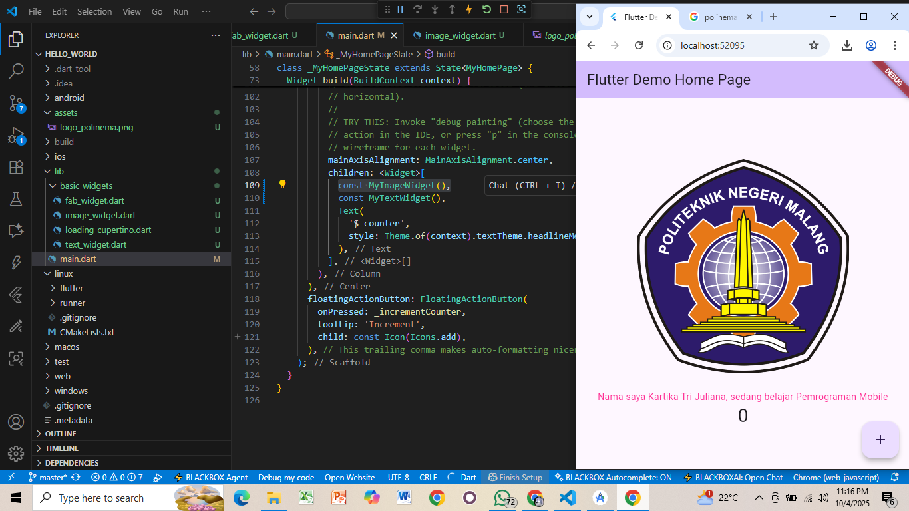

# Praktikum Flutter — Hello World & Widget Dasar  

**Mata Kuliah:** Pemrograman Mobile  
**Nama:** Kartika Tri Juliana  
**NIM:** 2341760116  
**Kelas:** SIB 3C  
**No Absen:** 19

**Repository:** [flutter-fundamental-part1] https://github.com/kartika3juli15/flutter-fundamental-part1.git  

---

## Praktikum 1: Membuat Project Flutter Baru
- Membuat project `hello_world` 
- Struktur project berhasil dibuat dengan pesan: `Your Flutter Project is ready!`.  
- Output awal adalah aplikasi counter bawaan Flutter.  

---

## Praktikum 2: Menjalankan Aplikasi di Emulator & Perangkat Fisik
- Aplikasi dijalankan pada emulator.  
- Nama & NIM ditampilkan pada tampilan aplikasi untuk identitas.  
 

---

## Praktikum 3: Integrasi GitHub & Dokumentasi
- Membuat repository GitHub: `flutter-fundamental-part1`.  
- Melakukan **init, add remote, commit, push** dari VS Code.  
- Semua file (source + README + screenshot) sudah terdokumentasi.  
  

---

## Praktikum 4: Widget Dasar
### Langkah 1 — Text Widget
Menampilkan teks dengan gaya warna merah dan ukuran font 14.  
 

### Langkah 2 — Image Widget
Menampilkan gambar dari `assets/logo_polinema.png`.  

  

---

## Praktikum 5: Widget Material Design & Cupertino
### Langkah 1 — Cupertino Button & Loading  
  

### Langkah 2 — Floating Action Button (FAB)   
  

### Langkah 3 — Scaffold Widget  
  

### Langkah 4 — Dialog Widget   
  

### Langkah 5 — Input & Selection (TextField)  
  

### Langkah 6 — Date Picker   
  

---
